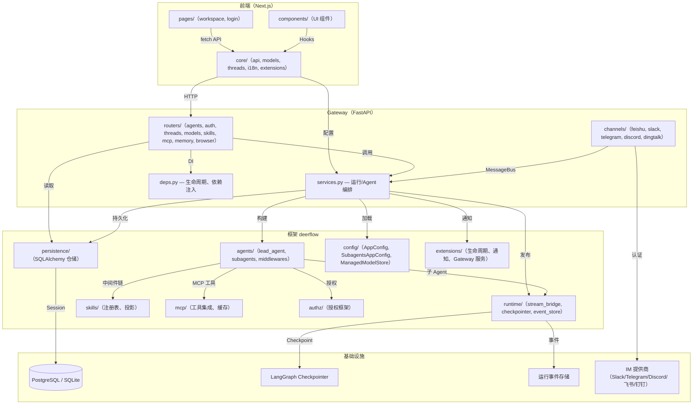
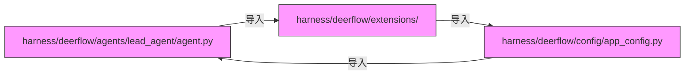

# DeerFlow CodeGraph 架构分析报告

> 基于 `codegraph_explore` 索引分析生成

---

## 1. 项目框架与目录分层架构

### 技术栈

| 层级 | 技术 |
|------|------|
| **前端** | Next.js 15（App Router）+ TypeScript + pnpm |
| **后端 API** | FastAPI（Python 3.12+）+ Uvicorn |
| **Agent 运行时** | LangGraph + LangChain + asyncio |
| **持久化** | SQLAlchemy Async + PostgreSQL / SQLite |
| **实时通信** | SSE（Server-Sent Events）via StreamBridge |
| **IM 通道** | WebSocket / Socket Mode（Slack、Telegram、Discord、飞书、钉钉） |
| **容器化** | Docker Compose + Nginx 反向代理 |

### 目录分层架构

```
deer-flow/
├── backend/
│   ├── app/                          # FastAPI Gateway 层
│   │   ├── gateway/                  # HTTP API 服务
│   │   │   ├── routers/              # REST 端点定义
│   │   │   ├── deps.py               # 依赖注入 & 生命周期
│   │   │   └── capabilities.py       # 插件/扩展适配器
│   │   └── channels/                 # IM 通道适配器
│   ├── packages/harness/deerflow/    # 核心 Agent 框架
│   │   ├── agents/                   # Lead Agent 与 Subagent 图逻辑
│   │   │   ├── lead_agent/           # LeadAgentAssembly + 图构建器
│   │   │   └── middlewares/          # 责任链中间件
│   │   ├── capabilities/             # 插件能力运行时
│   │   ├── config/                   # AppConfig、SubagentsAppConfig、ManagedModelStore
│   │   ├── extensions/               # 扩展生命周期与服务
│   │   ├── persistence/              # SQLAlchemy 仓储（Run、Thread、Project、MCP、定时任务）
│   │   ├── runtime/                  # Stream Bridge、Checkpointer、事件存储
│   │   ├── subagents/                # Subagent 执行器、批处理服务、配置
│   │   ├── skills/                   # 技能注册表与投影
│   │   ├── mcp/                      # MCP 工具集成
│   │   └── authz/                    # 授权框架
│   └── scripts/                      # 迁移与维护脚本
├── frontend/
│   ├── src/app/                      # Next.js App Router 页面
│   │   ├── workspace/                # 聊天、Agent、设置页面
│   │   └── login/                    # 认证页面
│   ├── src/components/               # React UI 组件
│   ├── src/core/                     # 业务逻辑、Hooks、API 客户端
│   │   ├── api/                      # API 客户端层
│   │   ├── models/                   # 模型类型定义与 Hooks
│   │   ├── threads/                  # 会话状态管理
│   │   └── extensions/               # 前端扩展加载
│   └── tests/                        # 前端单元测试 + E2E 测试
├── docker/                           # Compose 文件 + Nginx 配置
├── skills/                           # Agent 技能包（public/ + custom/）
├── contracts/                        # 跨组件 JSON 契约
├── config.example.yaml               # 根配置模板
└── extensions_config.example.json    # MCP + 技能配置模板
```

**分层职责：**

| 层级 | 路径 | 职责 |
|------|------|------|
| 入口层（Nginx） | — | 反向代理，端口 2026 |
| API Gateway | `backend/app/gateway/` | FastAPI 路由、认证、依赖注入 |
| IM 通道 | `backend/app/channels/` | Slack/Telegram/Discord/飞书/钉钉 适配器 |
| Agent 框架 | `backend/packages/harness/deerflow/` | LangGraph 图组装、中间件、子 Agent |
| 持久化层 | `backend/packages/harness/deerflow/persistence/` | SQLAlchemy 仓储，所有领域实体 |
| 前端层 | `frontend/src/` | Next.js 页面、React 组件、状态管理 |

---

## 2. 业务入口汇总

### API 路由（`backend/app/gateway/routers/`）

| 文件 | 路由前缀 | 标签 | 关键接口 |
|------|---------|------|---------|
| `agents.py` | `/api` | agents | 创建、列表、更新、删除 Agent |
| `artifacts.py` | `/api` | artifacts | 上传/下载运行产物 |
| `auth.py` | `/api/auth` | auth | `/login/local`、`/register`、`/logout`、`/me` |
| `browser.py` | `/api` | browser | 实时浏览器控制（`BrowserNavigateRequest`） |
| `features.py` | `/api` | features | `GET /api/features` — 功能开关探测 |
| `mcp.py` | `/api` | mcp | MCP 服务器管理 |
| `memory.py` | `/api` | memory | 用户记忆 CRUD |
| `models.py` | `/api` | models | `GET /api/models`、`GET /api/models/{name}` |
| `skills.py` | `/api` | skills | 技能管理 |
| `threads.py` | `/api` | threads | 会话列表、运行、取消、历史 |
| `subagents.py` | `/api` | subagents | 托管子 Agent CRUD |

### 主启动函数

```python
# backend/app/gateway/app.py
app = FastAPI(title="DeerFlow Gateway", lifespan=lifespan)

# backend/app/gateway/deps.py
async def langgraph_runtime(app: FastAPI, startup_config: AppConfig):
    """初始化：init_engine → make_checkpointer → make_store → make_stream_bridge
       → RunManager → extension start_services()"""

# docker/provisioner/app.py
app = FastAPI(title="DeerFlow Sandbox Provisioner", lifespan=lifespan)

# backend/scripts/migrate_memory_markdown.py
def main(argv=None) -> int { ... }   # 遗留数据迁移 CLI
```

### Gateway 路由注册（启动时 `app.py`）

所有路由挂载于 `/api/langgraph/`（LangGraph 兼容）和 `/api/`（DeerFlow 专属）：

```
/api/auth/*         → 认证路由
/api/agents/*       → Agent 路由
/api/models/*       → 模型路由
/api/skills/*       → 技能路由
/api/memory/*       → 记忆路由
/api/mcp/*          → MCP 路由
/api/browser/*      → 浏览器控制路由
/api/artifacts/*    → 产物路由
/api/features       → 功能开关
/api/subagents/*    → 子 Agent 路由
/api/langgraph/*    → LangGraph 流式端点
```

---

## 3. 核心业务执行链路（Mermaid 流程图）

```mermaid
flowchart TD
    A[用户通过 Web UI / IM 通道发送消息] --> B[FastAPI Gateway 接收请求]
    B --> C{路由分发}
    C -->|Web UI| D[POST /api/langgraph/threads/{id}/runs/stream]
    C -->|飞书| E[FeishuChannel._handle_message_event]
    C -->|Slack| F[SlackChannel._handle_message_event]
    C -->|Telegram| G[TelegramChannel._handle_inbound]
    C -->|Discord| H[DiscordChannel.handle_message]
    C -->|钉钉| I[DingTalkChannel._handle_message_event]
    
    D --> J["创建 RunRecord → RunManager.submit"]
    E --> J
    F --> J
    G --> J
    H --> J
    I --> J
    
    J --> K["run_agent() 后台工作线程"]
    K --> L["构建 RuntimeContext\n(thread_id, run_id, app_config, task_store, extensions)"]
    L --> M["确保 Checkpoint 模式兼容\n(checkpointer + checkpoint_ns)"]
    M --> N["构建 Agent: agent_factory()\n→ LeadAgentAssembly(graph, descriptor)"]
    N --> O["解包图: unwrap_agent_graph()"]
    O --> P["agent.astream(config) — LangGraph 图执行"]
    
    P --> Q{图节点：Lead Agent}
    Q --> R[工具调用: web_search, bash, task, memory 等]
    Q --> S[通过 task 工具委托子 Agent]
    Q --> T[Summarization 压缩中间件]
    Q --> U[目标评估器检查]
    
    R --> V[StreamBridge.publish(run_id, event)]
    S --> W[SubagentExecutor.execute()]
    W --> X["新建独立 LangGraph 运行\n携带 SubagentConfig"]
    X --> Y[结果 → SubagentResult 数据类]
    Y --> Z["结果返回至 Lead Agent 上下文"]
    
    V --> AA[SSE 流 → 前端]
    V --> BB[RunEventStore.put_batch() — 事件持久化]
    V --> CC[ThreadMetaRepository.update_status()]
    
    U --> DD{目标达成？}
    DD -->|是| EE["运行结束 → RunManager.set_status(completed)"]
    DD -->|否| P
    T -->|触发| FF[上下文压缩 → 归档消息 → memory_flush_hook 写入记忆]
    FF --> P
    
    EE --> GG["收尾: 关闭 StreamBridge, 排空进行中运行"]
    GG --> HH["Gateway 健康探针 /ready 返回 OK"]
```

---

## 4. 模块依赖图（Mermaid）



---

## 5. 数据库交互点

所有持久化均通过 **SQLAlchemy AsyncSession**，经仓储类访问。

### 仓储映射

| 仓储类 | 模型 | 表名 | 主要用途 |
|--------|------|------|---------|
| `RunRepository` | `RunRow` | `runs` | 运行生命周期（状态、元数据、进度） |
| `ThreadMetaRepository` | `ThreadMetaRow` | `thread_meta` | 会话状态、项目关联 |
| `ProjectRepository` | `ProjectRow` | `projects` | 项目 CRUD + 软删除（回收站） |
| `ProjectDocumentRepository` | `ProjectDocumentRow` | `project_documents` | 书架文档内容 |
| `ScheduledTaskRepository` | `ScheduledTaskRow` | `scheduled_tasks` | 定时 Agent 任务定义 |
| `ScheduledTaskRunRepository` | `ScheduledTaskRunRow` | `scheduled_task_runs` | 定时运行的单次实例 |
| `McpTaskRepository` | `McpTaskRow` | `mcp_tasks` | 持久化 MCP 任务状态 |
| `SubagentBatchRepository` | `SubagentBatchRow` | `subagent_batches` | 子 Agent 批处理执行历史 |
| `FeedbackRepository` | `FeedbackRow` | `feedback` | 用户对运行的反馈 |
| `PersonalAccessTokenRepository` | `PATRow` | `personal_access_tokens` | API 密钥管理 |

### 引擎初始化（启动时）

```python
# backend/app/gateway/deps.py:langgraph_runtime()
from deerflow.persistence.engine import init_engine_from_config, get_session_factory
await init_engine_from_config(config.database)  # PostgreSQL 或 SQLite
sf = get_session_factory()  # async_sessionmaker[AsyncSession]

# 所有仓储在启动时绑定到 sf
app.state.run_store = RunRepository(sf)
app.state.thread_store = ThreadMetaRepository(sf)
app.state.project_repo = ProjectRepository(sf)
app.state.scheduled_task_repo = ScheduledTaskRepository(sf, run_repository=...)
app.state.mcp_task_repo = McpTaskRepository(sf)
app.state.feedback_repo = FeedbackRepository(sf)
# ... 其余类似
```

### 非 ORM 持久化

| 组件 | 存储方式 | 说明 |
|------|---------|------|
| `ManagedModelStore` | 文件系统（加密 JSON） | `runtime_home()/managed-models/catalog.enc` |
| `FileMemoryStorage`（DeerMem） | 文件系统（Markdown） | 每用户记忆事实，路径 `{runtime_home}/users/{uid}/` |
| Checkpointer | PostgreSQL / SQLite / Redis | LangGraph 内置 Checkpointer 后端 |
| StreamBridge | 内存 / Redis | 实时 SSE 扇出 |
| RunEventStore | PostgreSQL | 时间序列运行事件，支持历史回放 |

---

## 6. 风险分析：循环依赖、核心模块、风险点

### 已知的循环依赖模式



**风险：`subagents` ↔ `agents` 启动死锁**

`deerflow.subagents` 包在初始化时导入 `deerflow.agents`（用于工具注册）。`deerflow.agents.lead_agent.agent` 又导入 `deerflow.extensions`，后者在启动时可能引用子 Agent 默认配置。代码通过函数内懒加载规避了该问题（见 `worker.py:731`——"懒加载：在模块加载时导入 deerflow.subagents 会触发其 `__init__`，进而反向导入导致 Gateway 启动死锁"）。

### 核心模块（高中介中心性）

| 模块 | 角色 | 为何核心 |
|------|------|---------|
| `deps.py`（Gateway） | 生命周期 & DI | 启动时初始化所有单例（engine、checkpointer、store、run_manager） |
| `agent.py`（lead_agent） | 图组装 | 从配置构建 LangGraph 图；`LeadAgentAssembly` 是唯一的真理来源 |
| `worker.py` | 运行执行 | `run_agent()` 是热点路径；每个 HTTP 请求和 IM 消息都流经此处 |
| `stream_bridge/` | 实时传输 | SSE 扇出是唯一通向前的实时路径 |
| `persistence/run/sql.py` | 运行持久化 | 49 个调用方；每次运行必须持久化 |
| `config/app_config.py` | 配置 | 启动时加载的单例 AppConfig；热重载边界 |
| `extensions/` | 扩展系统 | Gateway 生命周期服务、任务生命周期钩子 |

### 风险点清单

| 风险 | 位置 | 描述 |
|------|------|------|
| **循环导入死锁** | `subagents/__init__.py` ↔ `agents/lead_agent/agent.py` | 靠函数内懒加载规避，脆弱；任何新增的 eager import 都会破坏启动 |
| **SQLite 多 Worker 不兼容** | `deps.py:_enforce_postgres_for_multi_worker()` | SQLite 写锁无法支持并发多进程访问；有运行时强制检查，但单进程模式下无保护 |
| **Checkpoint 连接池关闭竞态** | `deps.py:finally` 块 | 运行中途的 Checkpoint 可能在 asyncio.run() 关闭后仍写入，导致 `PoolClosed`——已通过 drain-before-teardown 修复 |
| **扩展通知循环绑定** | `deps.py:434` | 若通知循环在子 Agent 启动后才注册，同步观测会被丢弃 |
| **热重载边界违规** | `deps.py` 文档字符串 | 运行时单例（engine、checkpointer、store）绑定到 `startup_config` 快照；请求级消费者必须通过 `get_config()` 获取可热重载字段 |
| **子 Agent 事件缓冲区刷写** | `worker.py:693-753` | 深层子 Agent（最多 150 轮）产生数百条 `task_running` 事件；逐条持久化会与运行自身的写入串行化——批量刷写是关键优化 |
| **租约争用** | `scheduled_tasks/sql.py:_lock_task()` | Postgres 用 `FOR UPDATE`，SQLite 用 `update(...updated_at=...)`；两处必须正确，否则任务卡死 |
| **前端扩展动态导入** | `registry.ts:32` | `import(/* webpackIgnore: true */ url)`——webpack/turbopack 不得 tree-shake；路径失效会静默破坏插件加载 |
| **记忆迁移版本漂移** | `migrate_memory_markdown.py:48` | `DOCUMENT_VERSION` 必须在迁移脚本和 DeerMem 读取器之间保持同步；版本漂移会静默损坏事实数据 |
| **IM 通道背压丢消息** | `channels/slack.py:401-411` | `_submit_threadsafe_coroutine` 在主循环停止时静默丢弃消息——尽力而为，无重试 |

### 依赖方向总结

```
前端 ──(HTTP)──> Gateway 路由 ──> Agent 框架 ──> 持久化层 / 运行时
     ↑                      ↑                      ↑                ↑
     └──── SSE 流 ←─────────┘                      │                │
                                                  │                └──→ PostgreSQL / SQLite
                                             扩展系统              Checkpointer
                                                  │
                                                  └──→ IM 通道 ←── 外部 Bot
```

**关键原则**：所有状态流动方向唯一，从 Gateway 向外经 Agent 框架分发；唯一反向流是 SSE 事件（Gateway → 前端）和 IM 入站事件（外部 Bot → Gateway）。
